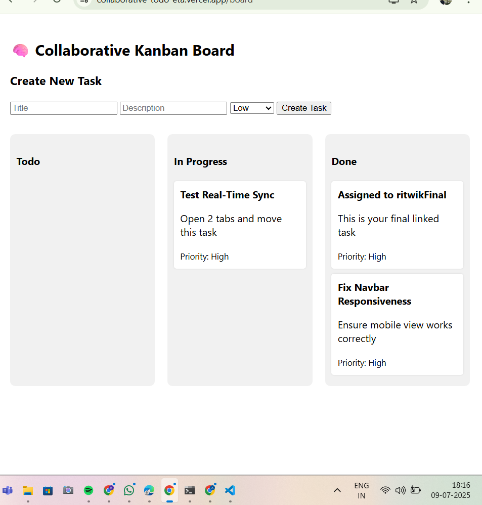

# 🧠 Real-Time Collaborative Kanban Board

A full-stack MERN application that allows multiple users to manage tasks collaboratively in real-time using drag-and-drop columns. Users can register, login, assign tasks, and see instant updates across all connected clients using Socket.IO.

## 🚀 Features

- 🔐 User Registration & Login (JWT Authentication)
- 📦 Create, Update, and Delete Tasks
- 🧠 Assign Tasks to Specific Users
- 📊 Drag-and-Drop Kanban Board (Todo, In Progress, Done)
- 🔁 Real-Time Sync Across Clients via Socket.IO
- 🌐 MongoDB Atlas Integration for Persistence
- 🧩 Modular backend structure using MVC pattern

## 🛠 Tech Stack

| Layer     | Tech                        |
|-----------|-----------------------------|
| Frontend  | React, Axios, React Router, react-beautiful-dnd |
| Backend   | Node.js, Express.js, Socket.IO |
| Database  | MongoDB Atlas + Mongoose    |
| Auth      | JWT, bcryptjs               |

## 📁 Folder Structure

collaborative-todo/
├── client/ # React frontend
├── server/ # Node + Express backend
├── README.md # Project overview


## ⚙️ Setup Instructions

### 1. 🔁 Clone the Repository

```bash
git clone https://github.com/ritwikduggi9/collaborative-todo.git
cd collaborative-todo

###2. 📦 Setup the Backend

cd server
npm install

🔐 Create .env in server/ folder
env
Copy
Edit
PORT=5000
MONGO_URI=mongodb+srv://<username>:<password>@cluster.mongodb.net/collab-todo?retryWrites=true&w=majority
JWT_SECRET=supersecretkey
CLIENT_URL=http://localhost:3000

Then run the backend:
node index.js

###3. 💻 Setup the Frontend
cd ../client
npm install
npm start

##🌐 Usage
Go to http://localhost:3000/register and create a new user.

Login using your credentials.

Create tasks, drag them between columns, and assign them to users.

Real-time updates will appear instantly across connected sessions


## 📸 Screenshot



## 🔗 Live Demo

Access the deployed app here:  
👉 [https://collaborative-todo-eta.vercel.app](https://collaborative-todo-eta.vercel.app)

## 🔗 Backend API

Live backend hosted on Render:  
👉 [https://collaborative-todo-backend-nzoy.onrender.com](https://collaborative-todo-backend-nzoy.onrender.com)

## 📄 License

This project is for educational purposes only.  
Built by **Ritwik Duggi**, 2025.


